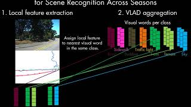

Code to reproduce the results of the paper at the time of the submission.

[Summary of the paper in video](https://www.youtube.com/watch?v=JeYpcRPqDUM&feature=youtu.be)

[](https://www.youtube.com/watch?v=JeYpcRPqDUM&feature=youtu.be)


# Usage
- Download the image segmentations, the codebook and the survey definitions (i.e. the files that specify the traversals).
- Extract local features to disk.
- Retrieve query images.

# Setup
This code is tested on Ubuntu 16.04. The cpp part depends on OpenCV 3.2.0.
The python packages needed are specified in `requirements.txt`.

We also provide a Dockerfile although it may not be necessary.

## Manual setup
Follow these instructions to prepare your machine to run the experiments.
#### cpp dependencies
- *OpenCV 3.2.0*
  - Archive download link: [link](https://github.com/opencv/opencv/archive/3.2.0.zip)
  - Installation instructions: [link](https://docs.opencv.org/master/d7/d9f/tutorial_linux_install.html)

- *(Optional) Faiss*
Only if you want to generate the codebook. An valid alternative is K-Means
scikit-learn implementation.

#### python dependencies
Run `pip3 install -r requirements.txt` to install all packages. 
Warning: this may change the version of your packages.
Recommended: Install only the packages you are missing.

#### Build wasabi2 and experiments
```bash
mkdir build
cd build
cmake ..
make
```


## Docker (incomplete)
The docker image is not complete yet, sorry.

Follow these instructions to run the experiments inside a docker image. 
This assumes you already have docker installed [nvidia-docker](https://github.com/NVIDIA/nvidia-docker). 

Build and run the docker image:
```bash
cd docker
make root # build
nvidia-docker run --volume="/path/to/wasabi2":"/home/ws" -it  -u root wasabi2 bash # run
```

## Datasets
### Extended-CMU-Seasons
Download all the segmentation:
```bash
cd meta/cmu/seg
./get_data.sh -1 # for all slices (<1G)
./get_data.sh 22 # for slice 22 only
```

Download the surveys i.e. the file lists specifying the traversals:
```bash
cd meta/cmu
./get_surveys.sh
```

### Symphony
Download the segmentation and the surveys:
```bash
cd meta/cmu/symphony/
./get_data.sh
```

### Codebooks
```bash
cd meta/cmu/codebooks/
./get_data.sh
```


# Reproduce the experiments
## Symphony
Extract the local feature to disk
```bash
./scripts/extract_features.sh symphony 0
```

Run the retrieval:
```bash
./scripts/wasabi2.sh symphony -1
```

Display the retrieval scores:
```bash
evince symphony.pdf
eog fig7_symphony.png
```


## Extended-CMU-Seasons
For clarity, this section explains how to run the experiments for the park slice 22. 
For the rest of the park and urban slices, see alternative commands appended with comments.


Extract the local feature to disk.
```bash
./scripts/extract_features.sh cmu_park 22 # for park slice22

./scripts/extract_features.sh cmu_park -1 # for all park retrievals
./scripts/extract_features.sh cmu_urban -1 # for all urban retrievals
```

Run the retrieval.
```bash
./scripts/wasabi2.sh cmu_park 22 # for park slice22

./scripts/wasabi2.sh cmu_park -1 # for all park retrievals
./scripts/wasabi2.sh cmu_urban -1 # for all city retrievals
```

Display the generated results in tabular form with 
```bash
evince cmu_park.pdf # replace cmu_park.pdf with cmu_urban.pdf and symphony.pdf for the other results
``

Display the plots of the generated results with 
```bash
evince fig5_cmu_park.png
evince fig6_cmu_park.png
```

Remark: This README does not desrcibe how to generate the results with compared methods (BOW, VLAD, NetVLAD, DELF, WASABI). These instructions are already available in the WASABI repo that we do not include here for it is not anonymous. The WASABI repo will be linked to this one once the review period is over.
